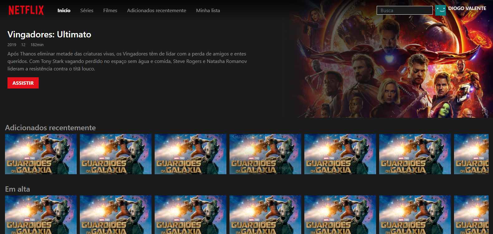
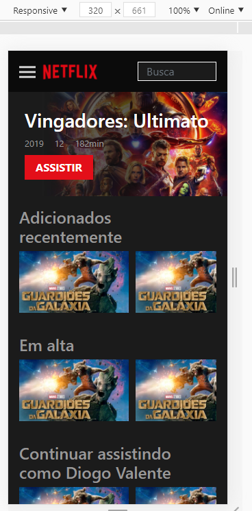

<h1 align="center">
  Netflix UX/UI Clone
</h1>

<h2>Quick Start</h2>
Apénas abra o index.html em seu navegador e está pronto!.

<h2>💻 Técnologias usadas</h2>
HTML, CSS, BOOTSTRAP e Jquery.

<h2>📷 Prints</h2>
<h3>Full Screen</h3>
</img>

<h3>Responsive 1</h3>
</img>

<h3>Responsive 2</h3>
</img>

